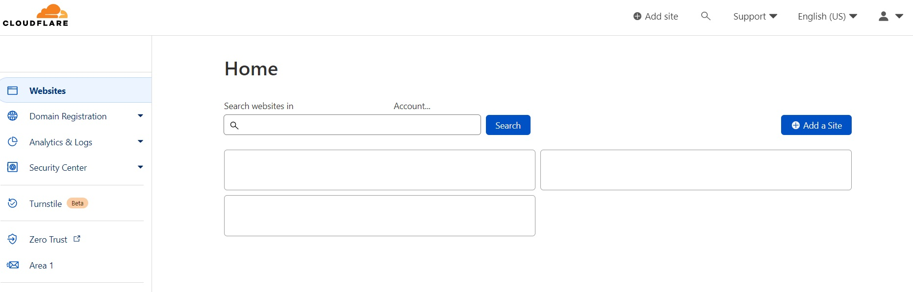
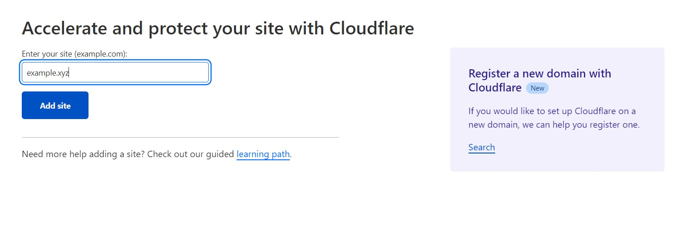
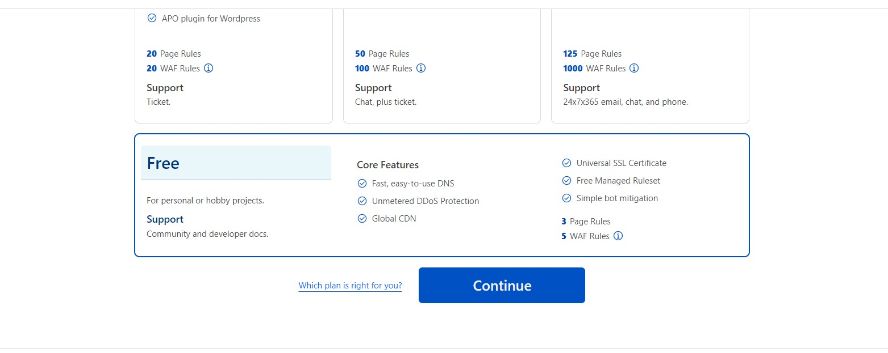
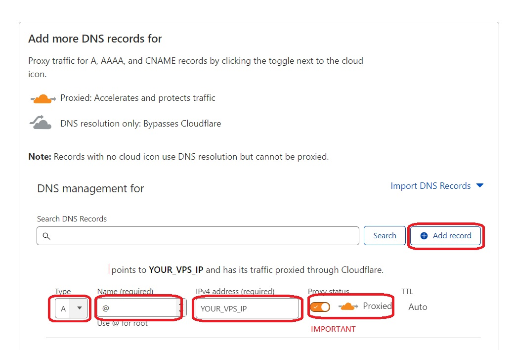
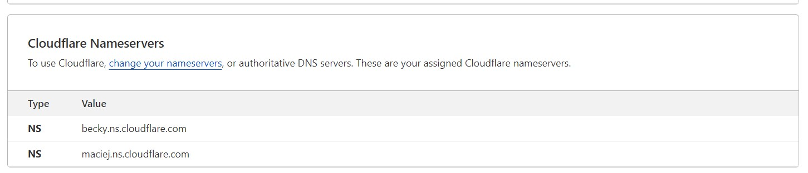
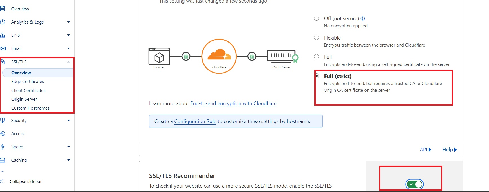
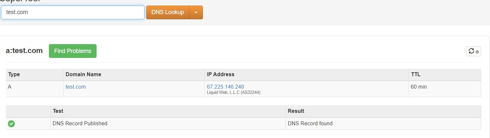

# FreeInternet
### This is a tutorial for how to make a fast VPN using CDN + VMESS/Vless + FakeWebsite

## :book: Table of Contents

</strong>Click to expand contents</strong>

* [Ingredients](#Ingredients)
* [Config CDN](#CDN)
* [Config your Domain](#Domain)
* [Setup V2ray Server](#V2ray)
* [Nginx With Fake Website](#Website)
* [Get SSL Certificate](#Certificate)
* [Config Nginx for your V2ray](#nginx-V2ray)

------

## :computer: Ingredients
what you need for this setup is really simple 

* Up and running Linux VPS   
* A domain name

------

## :rocket: Config CDN
#### 1. for CDN configuration you need to create an account in any free CDN website like Cloudflare AWS or any other CDN you like ( for Iranian [ArvanCloud](https://www.arvancloud.ir/en/products/cdn) or [Derak](https://derak.cloud/) also works very well and is recommended.)
for this tutorial, we will use Cloudflare.

* create an account in Cloudflare. this step is really simple.
go to your dashboard.

* click on `Add a site` and enter your domain name.

* On the next page select the free plan

* On the next page, you should config your DNS Record.
1. click on `Add Record`
2. Type: A
3. Name: @
4. Ip Address: Add your VPS IP address here
5. Proxy: **MAKE SURE PROXY IS ON** this is very important if you don't turn on this option your IP will be visible.
6. You can add a CNAME Or another A record for www.

* Cloudflare will give you 2 Nameservers that you need to update in your domain panel.

After Updating your DNS settings go to your SSL/TLS Menu and Select overview.

* put SSL/TLS encryption mode on Full (strict)
* Turn on SSL/TLS Recommender

That's it. we are done with Cloudflare. :)

## :satellite: Config your Domain
this is a simple step and it depends on how you got your domain.
you should update your domain's Name server in your domain panel with your CDN Name servers. Make sure they get updated and working fine. then continue to the next steps.

you can use any DnsLookup tools like [mxtoolbox.com](https://mxtoolbox.com/DNSLookup.aspx) This site should find your A record like the below image. It can take some time. it can take some time.

## :mahjong: Setup V2Ray 
Now it is getting exciting ...

## :ghost: Nginx With Fake Website 
This is where things get tricky but don't worry it is quite easy

## :lock: Get SSL Certificate
we are almost there we need to secure our connection.

## :bulb: Config Nginx for your V2ray
you made it. this is the golden part
