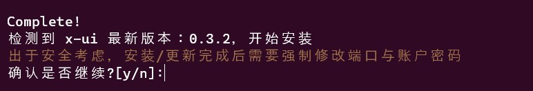
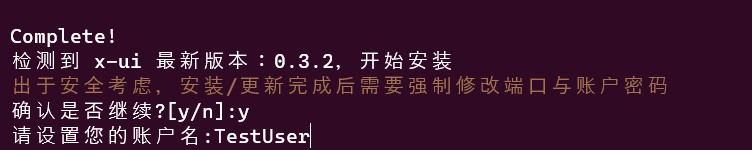
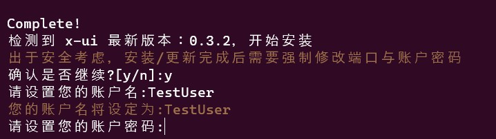
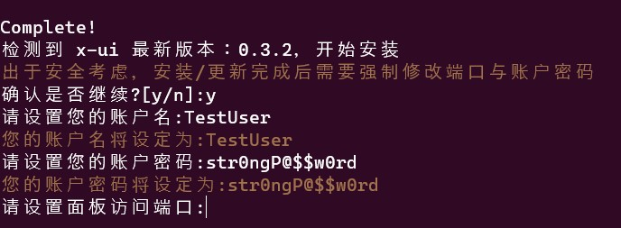
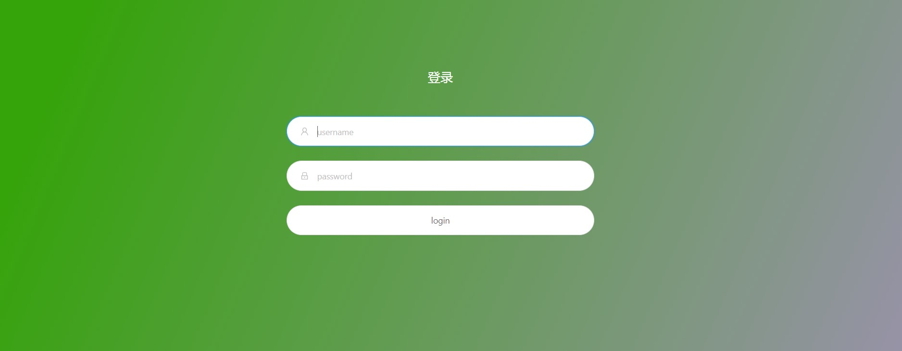
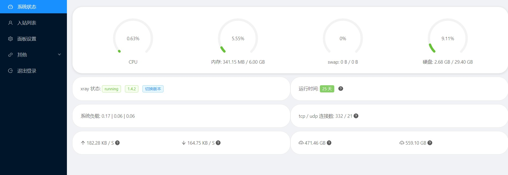

# FreeInternet
### This is a tutorial for how to make a fast VPN using CDN + VMESS/Vless + FakeWebsite

## :book: Table of Contents
<details>
<summary></strong>Click to expand contents</strong></summary>


* [Ingredients](#Ingredients)
* [Config CDN](#CDN)
* [Config your Domain](#Domain)
* [Install Nginx](#nginx)
* [Get SSL Certificate](#Certificate)
* [Setup V2ray Server](#V2ray)
* [Nginx With Fake Website](#Website)
* [Config Nginx for your V2ray](#nginx-V2ray)
* [Enable BBR](#BBR)

</details>

------

## <a name="Ingredients"></a>:computer: Ingredients
what you need for this setup is really simple 

* Up and running Linux VPS outside your country 
* A domain name

------

## <a name="CDN"></a>:rocket: Config CDN
#### 1. for CDN configuration you need to create an account in any free CDN website like Cloudflare AWS or any other CDN you like ( for Iranian [ArvanCloud](https://www.arvancloud.ir/en/products/cdn) or [Derak](https://derak.cloud/) also works very well and is recommended.)
for this tutorial, we will use Cloudflare.

* Create an account in Cloudflare. this step is really simple.
go to your dashboard.


* click on `Add a site` and enter your domain name.


* On the next page select the free plan


* On the next page, you should config your DNS Record.
1. click on `Add Record`
2. Type: A
3. Name: @
4. Ip Address: Add your VPS IP address here
5. Proxy: **MAKE SURE PROXY IS ON** this is very important if you don't turn on this option your IP will be visible.
6. You can add a CNAME Or another A record for www.


* Cloudflare will give you 2 Nameservers that you need to update in your domain panel.


After Updating your DNS settings go to your SSL/TLS Menu and Select overview.

* put SSL/TLS encryption mode on Full (strict)
* Turn on SSL/TLS Recommender


That's it. we are done with Cloudflare. :)

## <a name="Domain"></a>:satellite: Config your Domain
this is a simple step and it depends on how you got your domain.
you should update your domain's Name server in your domain panel with your CDN Name servers. Make sure they get updated and working fine. then continue to the next steps.

you can use any DnsLookup tools like [mxtoolbox.com](https://mxtoolbox.com/DNSLookup.aspx) This site should find your A record like the below image. It can take some time. it can take some time.


## <a name="Nginx"></a>:lock: Install Nginx
we need a webserver for our website and an SSL certificate.

**CentOS** :

Install the EPEL repository:
```console
sudo yum install epel-release
```

Update the repository and Install NGINX:
```console
sudo yum update
sudo yum install nginx
```
**Debina/ubuntu** :

Update the repository and Install NGINX:
```console
sudo apt-get update
sudo apt-get install nginx
```
you should be done. now we need a website.

## <a name="Website"></a>:ghost: Nginx With Fake Website 
This is where things get tricky but don't worry it is quite easy.

**NOTE:replace ALL `your_domain` with your actual domain.**

Create the directory for `your_domain` as follows, using the -p flag to create any necessary parent directories:

```console
sudo mkdir -p /var/www/your_domain/html
```
Next, assign ownership of the directory with the $USER environment variable:

```console
sudo chown -R $USER:$USER /var/www/your_domain/html
```

Next, create a sample index.html page using nano or your favorite editor:

```console
sudo nano /var/www/your_domain/html/index.html
```
Inside, add the following sample HTML or anything you like:
```HTML
<html>
    <head>
        <title>Welcome to your_domain!</title>
    </head>
    <body>
        <h1>Success!  The your_domain server block is working!</h1>
    </body>
</html>
```
Save and close the file by pressing Ctrl+X to exit, then when prompted to save, Y and then Enter.

I prefer to use a real website template and modify it to look like a real website. but it is your choice.

In order for Nginx to serve this content, it’s necessary to create a server block with the correct directives. Instead of modifying the default configuration file directly, let’s make a new one at /etc/nginx/sites-available/your_domain:


```console
sudo nano /etc/nginx/sites-available/your_domain
```

Paste in the following configuration block, which is similar to the default, but updated for our new directory and domain name:

```console
server {
        listen 80;
        listen [::]:80;

        root /var/www/your_domain/html;
        index index.html index.htm index.nginx-debian.html;

        server_name your_domain www.your_domain;

        location / {
                try_files $uri $uri/ =404;
        }
}
```

**MAKE SURE ALL `your_domain` HAS BEEN CHANGED WITH YOUR ACTUAL DOMAIN**

Next, let’s enable the file by creating a link from it to the sites-enabled directory, which Nginx reads from during startup:

```console
sudo ln -s /etc/nginx/sites-available/your_domain /etc/nginx/sites-enabled/
```
To avoid a possible hash bucket memory problem that can arise from adding additional server names, it is necessary to adjust a single value in the `/etc/nginx/nginx.conf`  file. Open the file:

```console
sudo nano /etc/nginx/nginx.conf
```
Find the `server_names_hash_bucket_size` directive and remove the # symbol to uncomment the line.

Save and close the file when you are finished.
Next, test to make sure that there are no syntax errors in any of your Nginx files:

```console
sudo nginx -t
```

If there aren’t any problems, restart Nginx to enable your changes:

```console
sudo systemctl restart nginx
```

## <a name="Certificate"></a>:lock: Get SSL Certificate
you need a valid SSL certificate for your website. make sure your firewall allows communication on ports 80 and 443.


we will use certbot and Let's Encrypt for our free SSL certificate.

The first step to using Let’s Encrypt to obtain an SSL certificate is to install the Certbot software on your server.

Install Certbot and its Nginx plugin with apt:

```console
sudo apt install certbot python3-certbot-nginx
```

Certbot provides a variety of ways to obtain SSL certificates through plugins. The Nginx plugin will take care of reconfiguring Nginx and reloading the config whenever necessary. To use this plugin, type the following:

```console
sudo certbot --nginx -d your_domain -d www.your_domain
```
This runs certbot with the --nginx plugin, using -d to specify the domain names we’d like the certificate to be valid for.

if certbot asked you the following question select number 2.

```console
Please choose whether or not to redirect HTTP traffic to HTTPS, removing HTTP access.
- - - - - - - - - - - - - - - - - - - - - - - - - - - - - - - - - - - - - - - -
1: No redirect - Make no further changes to the webserver configuration.
2: Redirect - Make all requests redirect to secure HTTPS access. Choose this for
new sites, or if you're confident your site works on HTTPS. You can undo this
change by editing your web server's configuration.
- - - - - - - - - - - - - - - - - - - - - - - - - - - - - - - - - - - - - - - -
Select the appropriate number [1-2] then [enter] (press 'c' to cancel):

```

if certbot has been able to get your certificate you should see the following message

```console
IMPORTANT NOTES:
 - Congratulations! Your certificate and chain have been saved at:
   /etc/letsencrypt/live/your_domain/fullchain.pem
   Your key file has been saved at:
   /etc/letsencrypt/live/your_domain/privkey.pem
   Your cert will expire on 2020-08-18. To obtain a new or tweaked
   version of this certificate in the future, simply run certbot again
   with the "certonly" option. To non-interactively renew *all* of
   your certificates, run "certbot renew"
 - If you like Certbot, please consider supporting our work by:

   Donating to ISRG / Let's Encrypt:   https://letsencrypt.org/donate
   Donating to EFF:                    https://eff.org/donate-le
```

your certificates are in the following directories you need them. so keep them safe and remember the path.

```console
/etc/letsencrypt/live/your_domain/fullchain.pem

/etc/letsencrypt/live/your_domain/privkey.pem
```

we are almost there. 

## <a name="V2ray"></a>:mahjong: Setup V2Ray 
Now it is getting exciting.
connect to your VPS via SSH. 
Get your server up to date:

ubuntu:

``` console
sudo apt update && sudo apt upgrade -y
````

RedHat centOS:

``` console
sudo yum update && sudo yum upgrade 
````

Download V2ray (x-UI panel) and install it.

``` console
sudo bash <(curl -Ls https://raw.githubusercontent.com/vaxilu/x-ui/master/install.sh)
```
Waiting for installation. unfortunately, this script is in Chinese and all English versions are outdated. so bear with me.
after you saw `complete` enter y 



then enter your username for the x-ui login


and then your password for X-ui panel (don't use this password set any strong password of at least 12 characters including symbols numbers capital letters :D )



now you need to set your panel port. the default port is 54321. you can keep that and press enter.


you should see a menu like this:


that means your X-ui installation is complete. you can check your x-ui service with `sudo x-ui status` command and start it with `sudo x-ui start`.

Now go to http://yourdomain.xyz:54321 you should see the x-ui login panel.



log in with your username and password that you have set during installation. you should see a dashboard like this.



use google chrome or Microsoft edge to translate it into english. before continue 

## <a name="nginx-V2ray"></a>:bulb: Config Nginx for your V2ray
you made it. this is the golden part

## <a name="BBR"></a>:bulb: Enable BBR
This part is optional but it has a big impact on your speed especially if you have too many users.
